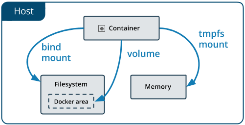

## 数据管理
默认情况下，在容器内创建的所有文件都存储在可写容器层中。这意味着：

当该容器不再运行时，数据不会持久存在，如果另一个进程需要，则可能很难从容器中获取数据。
容器的可写层紧密耦合到运行容器的主机。您无法轻松地将数据移动到其他位置。
写入容器的可写层需要存储驱动程序来管理文件系统。存储驱动程序使用Linux内核提供联合文件系统。与使用直接写入主机文件系统的数据卷相比，这种额外的抽象降低了性能。
Docker有两个容器选项可以在主机中存储文件，因此即使在容器停止之后文件仍然存在：卷和绑定挂载。如果你在Linux上运行Docker，你也可以使用tmpfs mount。

继续阅读有关这两种持久数据方式的更多信息。

## 如何选择挂载mount种类
无论采用什么挂载方式，从容器里面看来数据都是相同的。都是采用单文件或者文件夹的形式暴露在容器的文件系统中。

简单区分三种:卷（volumes），挂载(bind mounts ),临时文件系统（tmpfs）是看文件在宿主机上保存的地方



-  卷(volume)：文件保存在```/var/lib/docker/volumes/```linux主机上，是由docker管理的，非docker进程无法访问这块区域，卷是docker保存数据的最佳手段
-  绑定挂载(bind mount):文件可以保存在宿主机上任何位置，可以是文件，也可以是文件夹，非docker进程是可以修改的。
-  临时文件系统(tmpfs)：数据保存在系统内存中(memory),永不保存在文件系统上

## 更多细节
### 卷(volume)
卷是由docker创建的，你可以通过命令行``` docker volume create``` 来创建一个卷，或者在容器或者服务创建的时候自动创建。

当卷创建的时候，被保存在宿主机上，当将该卷挂载到容器上，这个目录就被挂载到该容器上了，这个就像是挂载那样子工作，但是这部分内容由docker来管理。和宿主机器是相互隔离开的

一个卷可以被多个容易挂载，当所有使用到该卷的容器不再运行，卷依旧保存在宿主机器上，如果你想要移除卷可以使用命令行``` docker volume prune| docker volume rm ...```

在挂载一个卷的时候，这个卷可以是有名字的或者是匿名(anonymous)的，匿名卷是没有显示设置名字的，docker在第一次挂载的时候随机取一个与该宿主机上其他卷不一样的名字。

卷还支持 ‘卷驱动’(```volume drivers ```)，可以将数据保存在远程的主机上，或者云主机上，或者其他的地方


### 绑定挂载（Bind mounts）
docker 在很早的版本就支持挂载了，相对于卷来说，挂载有很大的局限性，当你使用挂载功能时候，一个文件或者一个文件夹被挂载到容器里，这个文件或者文件夹必须使用路径全名。这个文件或者文件夹不需要在宿主机器上存在，当启动的时候，会自动创建。绑定挂载非常高效，但是依赖于宿主机器上的文件系统。如果您正在开发新的docker应用程序，请考虑使用卷，您无法使用docker命令直接管理绑定挂载

### 临时文件系统挂载(tmpfs mounts)
临时文件系统挂载不会保存数据，只有在容器的生命周期内才有效，swarm服务使用tmpfs挂载将秘密挂载到服务的容器中。

绑定挂载和卷都是通过命令``` -v | --volume```来操作的，但是语法却不相同。对于临时挂载，使用``` --tmpfs```来使用，在docker 17.06 或者更高版本中，我们推荐容器和服务使用 ```--mount```参数。

### 卷的使用场景
卷是在Docker容器和服务中持久保存数据的首选方法。卷的一些用例包括：

在多个运行容器之间共享数据。如果未显式创建它，则会在第一次将其装入容器时创建卷。当该容器停止或被移除时，该卷仍然存在。多个容器可以同时安装相同的卷，可以是读写也可以是只读。仅在您明确删除卷时才会删除卷。

当Docker主机不能保证具有给定的目录或文件结构时。 Volumes可帮助您将Docker主机的配置与容器运行时分离。

如果要将容器的数据存储在远程主机或云提供程序上，而不是本地存储。

当您需要备份，还原或将数据从一个Docker主机迁移到另一个Docker主机时，卷是更好的选择。您可以使用卷停止容器，然后备份卷的目录（例如/ var / lib / docker / volumes / <volume-name>）。

### 绑定挂载使用场景
通常，您应该尽可能使用卷。 绑定适用于以下类型的用例：

将配置文件从主机共享到容器。 这是Docker默认情况下通过将/etc/resolv.conf从主机安装到每个容器中来为容器提供DNS解析的方式。

在Docker主机上的开发环境和容器之间共享源代码或构建工件。 例如，您可以将Maven目标/目录安装到容器中，每次在Docker主机上构建Maven项目时，容器都可以访问重建的工件。

如果您以这种方式使用Docker进行开发，您的生产Dockerfile会将生产就绪工件直接复制到映像中，而不是依赖于绑定装载。

当Docker主机的文件或目录结构保证与容器所需的绑定装载一致时。

### 临时挂载使用场景

tmpfs挂载最适用于您不希望数据在主机或容器内持久存在的情况。 这可能是出于安全原因，或者在应用程序需要编写大量非持久状态数据时保护容器的性能。


### 使用绑定装入或卷的提示
如果您使用绑定装入或卷，请记住以下几点：

如果将空卷装入容器中存在文件或目录的目录中，则会将这些文件或目录传播（复制）到卷中。 同样，如果启动容器并指定尚不存在的卷，则会为您创建一个空卷。 这是预先填充另一个容器所需数据的好方法。

如果将绑定装载或非空卷装入容器中存在某些文件或目录的目录中，则装载会遮盖这些文件或目录，就像在Linux主机上将文件保存到/ mnt中一样 将USB驱动器安装到/ mnt中。 在卸载USB驱动器之前，/ mnt的内容将被USB驱动器的内容遮挡。 隐藏的文件不会被删除或更改，但在安装绑定装载或卷时无法访问。