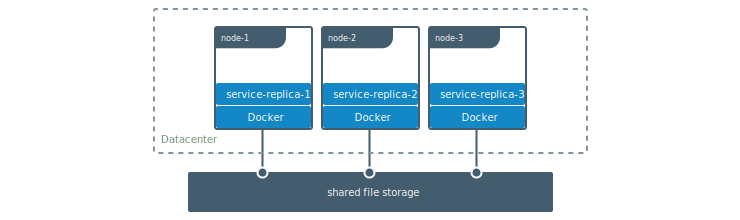

##  卷(volumes)

####  创建卷
```
$ docker volume create my-vol
```
#### 列举卷
```
$ docker volume ls

local               my-vol
```
#### 检查卷
```
$ docker volume inspect my-vol
[
    {
        "Driver": "local",
        "Labels": {},
        "Mountpoint": "/var/lib/docker/volumes/my-vol/_data",
        "Name": "my-vol",
        "Options": {},
        "Scope": "local"
    }
]
```

#### 移除卷
```
$ docker volume rm my-vol
```

#### 启动带有卷的容器
```
$ docker run -d \
  --name devtest \
  -v myvol2:/app \
  nginx:latest
```
```
$ docker run -d \
  --name devtest \
  --mount source=myvol2,target=/app \
  nginx:latest
```
#### 关闭容器移除卷
```
$ docker container stop devtest

$ docker container rm devtest

$ docker volume rm myvol2
```

#### 启动带有卷的服务
```
$ docker service create -d \
  --replicas=4 \
  --name devtest-service \
  --mount source=myvol2,target=/app \
  nginx:latest
```
检查服务运行状态
```
$ docker service ps devtest-service

ID                  NAME                IMAGE               NODE                DESIRED STATE       CURRENT STATE            ERROR               PORTS
4d7oz1j85wwn        devtest-service.1   nginx:latest        moby                Running             Running 14 seconds ago
```
移除服务
```
docker service rm devtest-service
```
#### 使用容器填充卷
```
$ docker run -d \
  --name=nginxtest \
  --mount source=nginx-vol,destination=/usr/share/nginx/html \
  nginx:latest
```
或者
```
$ docker run -d \
  --name=nginxtest \
  -v nginx-vol:/usr/share/nginx/html \
  nginx:latest
```
移除容器
```
$ docker container stop nginxtest

$ docker container rm nginxtest

$ docker volume rm nginx-vol
```
#### 使用制度卷
```
$ docker run -d \
  --name=nginxtest \
  --mount source=nginx-vol,destination=/usr/share/nginx/html,readonly \
  nginx:latest
```
或者
```
$ docker run -d \
  --name=nginxtest \
  -v nginx-vol:/usr/share/nginx/html:ro \
  nginx:latest
```
检查
```
docker inspect nginxtest
...
"Mounts": [
    {
        "Type": "volume",
        "Name": "nginx-vol",
        "Source": "/var/lib/docker/volumes/nginx-vol/_data",
        "Destination": "/usr/share/nginx/html",
        "Driver": "local",
        "Mode": "",
        "RW": false,
        "Propagation": ""
    }
],
...
```

### 在机器之间分享数据


在开发应用程序时，有几种方法可以实现此目的。 一种是为应用程序添加逻辑，以将文件存储在Amazon S3等云对象存储系统上。 另一种方法是使用支持将文件写入NFS或Amazon S3等外部存储系统的驱动程序创建卷。

卷驱动程序允许您从应用程序逻辑中抽象底层存储系统。 例如，如果您的服务使用具有NFS驱动程序的卷，则可以更新服务以使用其他驱动程序，例如在云中存储数据，而无需更改应用程序逻辑。

#### 使用卷驱动
使用docker volume create创建卷时，或者启动使用尚未创建的卷的容器时，可以指定卷驱动程序。 以下示例使用vieux / sshfs卷驱动程序，首先在创建独立卷时，然后在启动创建新卷的容器时使用。

##### 初始化设置
此示例假定您有两个节点，第一个节点是Docker主机，可以使用SSH连接到第二个节点。

在宿主机上安装 ``` vieux/sshfs ``` 插件
 ```
 $ docker plugin install --grant-all-permissions vieux/sshfs
 ```
 ##### 创建卷驱动创建卷
 此示例指定SSH密码，但如果两台主机配置了共享密钥，则可以省略密码。 每个卷驱动程序可以具有零个或多个可配置选项，每个选项都使用-o标志指定。
 ```
 $ docker volume create --driver vieux/sshfs \
  -o sshcmd=test@node2:/home/test \
  -o password=testpassword \
  sshvolume
 ```
 ##### 启动使用卷驱动程序创建卷的容器
 此示例指定SSH密码，但如果两台主机配置了共享密钥，则可以省略密码。 每个卷驱动程序可以具有零个或多个可配置选项。 如果卷驱动程序要求您传递选项，则必须使用--mount标志来装入卷，而不是-v

 ```
 $ docker run -d \
  --name sshfs-container \
  --volume-driver vieux/sshfs \
  --mount src=sshvolume,target=/app,volume-opt=sshcmd=test@node2:/home/test,volume-opt=password=testpassword \
  nginx:latest
 ```

 #### 备份，还原或迁移数据卷
 卷对备份，还原和迁移很有用。 使用--volumes-from标志创建一个安装该卷的新容器。

 ##### 备份容器
 ```
 $ docker run --rm --volumes-from dbstore -v $(pwd):/backup ubuntu tar cvf /backup/backup.tar /dbdata
 ```
##### 回滚
```
$ docker run -v /dbdata --name dbstore2 ubuntu /bin/bash

$ docker run --rm --volumes-from dbstore2 -v $(pwd):/backup ubuntu bash -c "cd /dbdata && tar xvf /backup/backup.tar --strip 1"
```
#### 移除所有卷
```
$ docker volume prune
```
