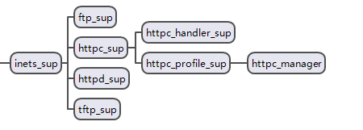
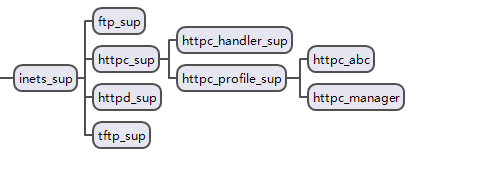
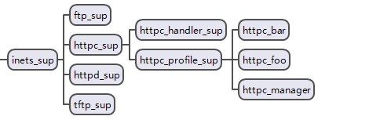

# httpc

#### 默认情况下httpc监控树结构

#### httpc 的瓶颈所在
##### 调用栈
1.  httpc:request/x
2.  httpc:do_request/x
3.  httpc:handle_request/x
4.  httpc_manager:request
5.  httpc_manager:call(__gen_server call__)
6.  httpc_manager:handle_request(**in gen_server**)
7.  httpc_manager:start_handler ```(  httpc_handler_sup:start_child([whereis(httpc_handler_sup), Request, Options, ProfileName]) )```
8.  ......

从上面的调用栈可以看到瓶颈在httpc_manager这个gen_server

#### 如何突破上面提到的瓶颈呢？
##### 1. 增加httpc_profile_sup的worker
```
httpc_profile_sup:start_child([{profile,abc}]).
httpc:request("http://192.168.3.231:8011/public/index",abc).                                      
{ok,{{"HTTP/1.1",200,"OK"},
     [{"date","Tue, 07 Aug 2018 09:46:38 GMT"},
      {"server","Cowboy"},
      {"content-length","5"}],
     "Alive"}}

```


##### 2.启动文件添加
```
...
{inets, [
    {services, [
      {httpc, {default, only_session_cookies}},
      {httpc, {foo, only_session_cookies}},
      {httpc, {bar, only_session_cookies}}
    ]}
  ]}
...
```

##### 性能验证。
```
% my_httpc.erl

-export([get/3]).

ts()->
  {MegaSecs, Secs, MicroSecs} = os:timestamp(),
  MegaSecs * 1000*1000*1000 + Secs*1000 + (MicroSecs div 1000).

get(URL,Profile,N)->
  P = self(),
  S = ts(),
  do_get(P,URL,Profile,N),
  do_reduce(0,N),
  E = ts(),
  io:format("cost ~p ms with ~p req~n",[(E-S),N]).

do_get(_P,_URL,_Profile,N) when N < 1 -> ok;
do_get(P,URL,Profile,N) ->
  erlang:spawn( fun()->  do_map(P,URL,Profile) end ),
  do_get(P,URL,Profile,N-1).

do_map(Parent,URL,undefined)->
  R = httpc:request(URL),
  Parent ! R;
do_map(Parent,URL,Profile) when is_atom(Profile)->
  R = httpc:request(URL),
  Parent ! R;
do_map(Parent,URL,L) when is_list(L)->
  R = [httpc:request(URL,X) || X<-L],
  Parent ! R.

do_reduce(C,Total) when C >= Total -> ok;
do_reduce(C,Total) ->
  receive
     _ -> do_reduce(C+1,Total)
  end.

```

验证结果
```
(myapp_1@127.0.0.1)9> my_httpc:get("http://192.168.3.231:8011/public/index",[default,default],1000).
cost 211 ms with 1000 req
(myapp_1@127.0.0.1)10> my_httpc:get("http://192.168.3.231:8011/public/index",[default,abc],1000).    
cost 162 ms with 1000 req
```
