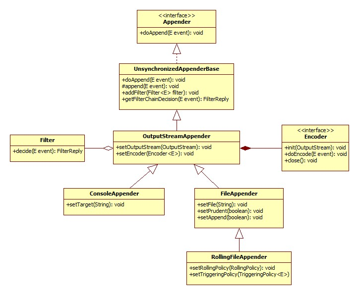

# [Appender](https://logback.qos.ch/manual/appenders.html)

## 什么是Appender
Logback将写入日志事件的任务委托给名为appender的组件。 Appender必须实现ch.qos.logback.core.Appender接口。 这个接口的显着方法总结如下：
```
package ch.qos.logback.core;
  
import ch.qos.logback.core.spi.ContextAware;
import ch.qos.logback.core.spi.FilterAttachable;
import ch.qos.logback.core.spi.LifeCycle;
  

public interface Appender<E> extends LifeCycle, ContextAware, FilterAttachable {

  public String getName();
  public void setName(String name);
  void doAppend(E event);
  
}
```
Appender接口中的大多数方法都是setter和getters。一个值得注意的例外是doAppend（）方法将E类型的对象实例作为其唯一参数。 E的实际类型将根据logback模块而有所不同。在logback-classic模块中，E将是ILoggingEvent类型，而在logback-access模块​​中，它将是AccessEvent类型。 doAppend（）方法可能是logback框架中最重要的方法。它负责将适当格式的记录事件输出到适当的输出设备。

Appender是命名实体。这确保了它们可以通过名称被引用，这是一种被确认在配置脚本中很有用的质量。 Appender接口扩展了FilterAttachable接口。因此可以将一个或多个过滤器附加到appender实例。过滤器将在后面的章节中详细讨论。

Appenders最终负责输出日志记录事件。但是，他们可以将事件的实际格式委托给布局或编码器对象。每个布局/编码器都与一个且只有一个appender关联，称为拥有appender。一些appender具有内置或固定的事件格式。因此，他们不需要也没有布局/编码器。例如，SocketAppender只需将日志事件序列化，然后再通过线路传输它们。


## AppenderBase
ch.qos.logback.core.AppenderBase类是实现Appender接口的抽象类。 它提供了所有appender共享的基本功能，例如获取或设置其名称的方法，激活状态，布局和过滤器。 它是与logback一起发运的所有appender的超级类别。 尽管是一个抽象类，AppenderBase实际上在Append接口中实现了doAppend（）方法。 也许讨论AppenderBase类最清晰的方法是通过提供实际源代码的摘录。

```
public synchronized void doAppend(E eventObject) {

  // prevent re-entry.
  if (guard) {
    return;
  }

  try {
    guard = true;

    if (!this.started) {
      if (statusRepeatCount++ < ALLOWED_REPEATS) {
        addStatus(new WarnStatus(
            "Attempted to append to non started appender [" + name + "].",this));
      }
      return;
    }

    if (getFilterChainDecision(eventObject) == FilterReply.DENY) {
      return;
    }
    
    // ok, we now invoke the derived class's implementation of append
    this.append(eventObject);

  } finally {
    guard = false;
  }
}
```
doAppend（）方法的这个实现是同步的。由此可见，从不同线程登录到相同的appender是安全的。当一个线程（比如说T）正在执行doAppend（）方法时，其他线程的后续调用将排队，直到T离开doAppend（）方法，从而确保T独占访问appender。

由于这种同步并不总是合适的，logback附带了与AppenderBase类非常相似的ch.qos.logback.core.UnsynchronizedAppenderBase。为了简洁起见，我们将在本文的其余部分讨论UnsynchronizedAppenderBase。

doAppend（）方法的第一件事是检查guard是否设置为true。如果是，它立即退出。如果守卫未设置，则在下一个语句中将其设置为true。警卫确保doAppend（）方法不会递归调用它自己。试想一下，在append（）方法之外调用的某个组件想要记录某些内容。它的调用可以被引导到刚刚调用它的同一个appender，导致无限循环和堆栈溢出。

在下面的语句中，我们检查起始字段是否为真。如果不是，doAppend（）将发送一条警告消息并返回。换句话说，一旦appender关闭，就不可能写入。 Appender对象实现了LifeCycle接口，这意味着它们实现了start（），stop（）和isStarted（）方法。在设置appender的所有属性后，logback的配置框架Joran会调用start（）方法来通知appender激活其属性。根据其种类的不同，如果某些属性丢失或者由于各种属性之间的干扰，appender可能无法启动。例如，假定文件创建取决于截断模式，则FileAppender不能对其“文件”选项的值进行操作，直到Append选项的值也可以确定。显式激活步骤可确保appender在其值已知之后对属性起作用。

如果appender无法启动或者已停止，则会通过logback的内部状态管理系统发出警告消息。经过多次尝试后，为避免内部状态系统泛滥同样的警告消息，doAppend（）方法将停止发出这些警告。

下一个if语句检查附加过滤器的结果。根据过滤器链的决定，可以拒绝或明确接受事件。在没有过滤器链决定的情况下，默认情况下会接受事件。

doAppend（）方法然后调用派生类的append（）方法的实现。该方法执行将事件附加到适当设备的实际工作。

最后，释放警卫以允许随后调用doAppend（）方法。

对于本手册的其余部分，我们保留术语“选项”或“属性”，用于通过setter和getter方法使用JavaBeans内省动态推断的任何属性。

## Logback-core
Logback-core奠定了构建其他Logback模块的基础。 一般来说，logback-core中的组件需要一些（尽管很少）定制。 但是，在接下来的几节中，我们将介绍几种可以立即使用的appender。

### OutputStreamAppender
OutputStreamAppender将事件追加到java.io.OutputStream。 此课程提供其他appender基于的基本服务。 用户通常不直接实例化OutputStreamAppender对象，因为通常java.io.OutputStream类型不能方便地映射到字符串，因为无法在配置脚本中指定目标OutputStream对象。 简而言之，您无法从配置文件中配置OutputStreamAppender。 但是，这并不意味着OutputStreamAppender缺少可配置的属性。 接下来介绍这些属性。

属性名称 | type | desc 
--- | --- | ---
encoder | [Encoder](https://logback.qos.ch/xref/ch/qos/logback/core/encoder/Encoder.html) | 确定事件写入底层OutputStreamAppender的方式。 编码器在专用章节中介绍。
immediateFlush | boolean | immediateFlush的默认值是'true'。 即时刷新输出流可确保记录事件立即写出并且在您的应用程序退出但未正确关闭appender时不会丢失。 另一方面，将此属性设置为'false'可能会使记录吞吐量翻两番（您的里程可能会有所不同）。 同样，如果immediateFlush设置为'false'，并且如果appender在应用程序退出时未正确关闭，那么记录尚未写入磁盘的事件可能会丢失。

OutputStreamAppender是另外三个appender的超类，即ConsoleAppender，FileAppender，它又是RollingFileAppender的超类。 下图说明了OutputStreamAppender及其子类的类图。



### ConsoleAppender
ConsoleAppender（正如名称所示）附加在控制台上，或者更确切地说在System.out或System.err上，前者是默认目标。 ConsoleAppender在用户指定的编码器的帮助下对事件进行格式化。 编码器将在随后的章节中讨论。 System.out和System.err都是java.io.PrintStream类型。 因此，它们被封装在缓冲I / O操作的OutputStreamWriter中。

Property Name	|Type|	Description
---|---|---
encoder | Encoder | 请参阅OutputStreamAppender属性
target | String | 其中一个字符串值为System.out或System.err。 默认目标是System.out
withJansi | boolean | 默认情况下，使用Jansi属性设置为false。 使用Jansi设置为true将激活Jansi库，该库为Windows机器上的ANSI颜色代码提供支持。 在Windows主机上，如果此属性设置为true，则应该在类路径中放置“org.fusesource.jansi：jansi：1.9”。 请注意，基于Unix的操作系统（如Linux和Mac OS X）默认支持ANSI颜色

##### logback-Console.xml
```
<configuration>

  <appender name="STDOUT" class="ch.qos.logback.core.ConsoleAppender">
    <!-- encoders are assigned the type
         ch.qos.logback.classic.encoder.PatternLayoutEncoder by default -->
    <encoder>
      <pattern>%-4relative [%thread] %-5level %logger{35} - %msg %n</pattern>
    </encoder>
  </appender>

  <root level="DEBUG">
    <appender-ref ref="STDOUT" />
  </root>
</configuration>
```
### FileAppender
FileAppender是OutputStreamAppender的子类，它将日志事件附加到文件中。 目标文件由File选项指定。 如果该文件已存在，则根据append属性的值将其附加到或截断。

Property Name|	Type|	Description
--- | --- | ---
append | boolean |  如果为true，则将事件附加到现有文件的末尾。 否则，如果append为false，则任何现有文件都将被截断。 追加选项默认设置为true。
encoder | Encoder | 请参阅OutputStreamAppender属性
file | String | 要写入的文件的名称。 如果该文件不存在，则会创建该文件。 在MS Windows平台上，用户经常忘记避开反斜杠
prudent | boolean |在谨慎的模式下，FileAppender将安全地写入指定的文件，即使存在运行在不同JVM中的其他FileAppender实例，也可能运行在不同的主机上。 谨慎模式的默认值为false。

谨慎模式可以与RollingFileAppender结合使用，尽管有一些限制。

谨慎模式意味着append属性自动设置为true。

谨慎更多地依赖于独占文件锁定。实验表明，文件锁定大约是写入日志记录事件成本的三倍（x3）。在“平均”PC上写入位于本地硬盘上的文件时，谨慎模式关闭时，写入单个日志记录事件大约需要10微秒。启动谨慎模式时，输出单个记录事件大约需要30微秒。这意味着当审慎模式关闭时，每秒记录吞吐量为100'000个事件，在审慎模式下每秒记录约33'000个事件。

谨慎模式有效地序列化写入同一文件的所有JVM之间的I / O操作。因此，随着竞争访问文件的JVM数量的增加，每个I / O操作所引起的延迟也会增加。只要I / O操作的总数量为每秒20个日志请求的数量级，对性能的影响应该可以忽略不计。每秒产生100个或更多I / O操作的应用程序可能会对性能产生影响，应避免使用审慎模式。

联网文件锁当日志文件位于联网文件系统上时，审慎模式的成本更高。同样重要的是，对网络文件系统的文件锁定有时会产生强烈的偏见，以致当前拥有该锁的进程在其释放后立即重新获得该锁。因此，当一个进程占用日志文件的锁定时，其他进程就会等待锁定到出现死锁的地步。

审慎模式的影响主要取决于网络速度以及操作系统实施细节。我们提供了一个称为FileLockSimulator的非常小的应用程序，它可以帮助您模拟环境中谨慎模式的行为。

默认情况下，每个日志事件立即刷新到基础输出流。 这种默认方法更安全，因为如果您的应用程序没有正确关闭appender而退出，日志事件不会丢失。 但是，为了显着提高日志记录吞吐量，您可能需要将immediateFlush属性设置为false。

##### logback-fileAppender.xml
```
<configuration>

  <appender name="FILE" class="ch.qos.logback.core.FileAppender">
    <file>testFile.log</file>
    <append>true</append>
    <!-- set immediateFlush to false for much higher logging throughput -->
    <immediateFlush>true</immediateFlush>
    <!-- encoders are assigned the type
         ch.qos.logback.classic.encoder.PatternLayoutEncoder by default -->
    <encoder>
      <pattern>%-4relative [%thread] %-5level %logger{35} - %msg%n</pattern>
    </encoder>
  </appender>
        
  <root level="DEBUG">
    <appender-ref ref="FILE" />
  </root>
</configuration>
```

### 唯一命名的文件（按时间戳）
在应用程序开发阶段或在短期应用程序的情况下，例如 批处理应用程序时，最好在每次启动新应用程序时创建一个新的日志文件。 这很容易在<timestamp>元素的帮助下完成。 这是一个例子。
##### logback-timestamp.xml
```
<configuration>

  <!-- Insert the current time formatted as "yyyyMMdd'T'HHmmss" under
       the key "bySecond" into the logger context. This value will be
       available to all subsequent configuration elements. -->
  <timestamp key="bySecond" datePattern="yyyyMMdd'T'HHmmss"/>

  <appender name="FILE" class="ch.qos.logback.core.FileAppender">
    <!-- use the previously created timestamp to create a uniquely
         named log file -->
    <file>log-${bySecond}.txt</file>
    <encoder>
      <pattern>%logger{35} - %msg%n</pattern>
    </encoder>
  </appender>

  <root level="DEBUG">
    <appender-ref ref="FILE" />
  </root>
</configuration>
```
timestamp元素采用两个强制属性key和datePattern以及一个可选的timeReference属性。 关键属性是时间戳将作为变量可供后续配置元素使用的密钥的名称。 datePattern属性表示用于将当前时间（配置文件被解析的时间）转换为字符串的日期模式。 日期模式应该遵循SimpleDateFormat中定义的约定。 timeReference属性表示时间戳的时间基准。 缺省值是配置文件的解释/解析时间，即当前时间。 但是，在某些情况下，将上下文出生时间用作时间参考可能很有用。 这可以通过将timeReference属性设置为“contextBirth”来实现。

要使用记录器上下文出生日期作为时间参考，可以将timeReference属性设置为“contextBirth”，如下所示。

##### logback-timestamp-contextBirth.xml
```
<configuration>
  <timestamp key="bySecond" datePattern="yyyyMMdd'T'HHmmss" 
             timeReference="contextBirth"/>
  ...
</configuration>
```

### RollingFileAppender
RollingFileAppender扩展了FileAppender，具有翻转日志文件的功能。 例如，RollingFileAppender可以登录到名为log.txt文件的文件，并且一旦满足某个条件，就将其日志目标更改为另一个文件。

有两个与RollingFileAppender交互的重要子组件。 第一个RollingFileAppender子组件，即RollingPolicy（见下文）负责执行滚动所需的操作。 RollingFileAppender的第二个子组件，即TriggeringPolicy（见下文）将确定是否以及确切地发生翻转时。 因此，RollingPolicy负责什么和TriggeringPolicy是什么时候负责的。

为了任何用途，RollingFileAppender必须同时设置RollingPolicy和TriggeringPolicy。 但是，如果其RollingPolicy也实现了TriggeringPolicy接口，则只需要明确指定前者。

Property Name|	Type	|Description
--- | --- | ---
file | String | 请参阅FileAppender属性。
append | boolean | 
encoder | Encoder |
rollingPolicy | RollingPolicy | 此选项是组件，它将决定发生翻滚时RollingFileAppender的行为。 请参阅以下更多信息。
triggeringPolicy | TriggeringPolicy	 | 此选项是将告诉RollingFileAppender何时激活翻转过程的组件。 请参阅以下更多信息。
prudent |  boolean | FixedWindowRollingPolicy在审慎模式下不受支持

### 滚动策略概述
RollingPolicy负责涉及文件移动和重命名的翻转过程。

RollingPolicy接口如下所示：
```
package ch.qos.logback.core.rolling;  

import ch.qos.logback.core.FileAppender;
import ch.qos.logback.core.spi.LifeCycle;

public interface RollingPolicy extends LifeCycle {

  public void rollover() throws RolloverFailure;
  public String getActiveFileName();
  public CompressionMode getCompressionMode();
  public void setParent(FileAppender appender);
}
```
翻转方法完成了归档当前日志文件所涉及的工作。 调用getActiveFileName（）方法来计算当前日志文件的文件名（其中写入实时日志）。 如getCompressionMode方法所示，RollingPolicy还负责确定压缩模式。 最后，通过setParent方法给RollingPolicy一个对其父代的引用。

##### TimeBasedRollingPolicy
TimeBasedRollingPolicy可能是最受欢迎的滚动策略。 它定义了基于时间的翻转策略，例如按天或按月。 TimeBasedRollingPolicy承担翻转和触发翻滚的责任。 事实上，TimeBasedTriggeringPolicy实现了RollingPolicy和TriggeringPolicy接口。

TimeBasedRollingPolicy的配置需要一个必需的fileNamePattern属性和几个可选属性。

Property Name|	Type|	Description
--- | --- | ---
fileNamePattern | String |
maxHistory | int |
totalSizeCap | int |
cleanHistoryOnStart | boolean | 

这里有一些fileNamePattern值和一个解释它们的影响
fileNamePattern	|Rollover schedule|	Example
--- | --- | ---
/wombat/foo.%d | 每日滚动（午夜）。 由于省略了％d标记说明符的可选时间和日期模式，因此假定为yyyy-MM-dd的默认模式，该模式对应于每日滚动。| 
/wombat/%d{yyyy/MM}/foo.txt | 在每个月初开始滚动。 |
/wombat/foo.%d{yyyy-ww}.log | 在每周的第一天滚动。 请注意，本周的第一天取决于语言环境。 |
/wombat/foo%d{yyyy-MM-dd_HH}.log | 在每个小时的顶部滚动。 |
/wombat/foo%d{yyyy-MM-dd_HH-mm}.log | 每分钟开始时都会滚动。|
/wombat/foo%d{yyyy-MM-dd_HH-mm, UTC}.log | 每分钟开始时都会滚动。|
/foo/%d{yyyy-MM,aux}/%d.log | 每日滚动。 位于包含年份和月份的文件夹下的档案|
/wombat/foo.%d.gz | 使用自动GZIP压缩归档文件的每日滚动（在午夜）。 |
任何向前或向后的斜线字符都被解释为文件夹（目录）分隔符。 任何必需的文件夹将根据需要创建。 因此，您可以轻松地将日志文件放在单独的文件夹中。
TimeBasedRollingPolicy支持自动文件压缩。 如果fileNamePattern选项的值以.gz或.zip结尾，则启用此功能。

fileNamePattern具有双重用途。首先，通过研究模式，logback计算请求的翻转周期。其次，它计算每个存档文件的名称。请注意，两种不同的模式可以指定相同的周期。模式yyyy-MM和yyyy @ MM都指定每月翻转，但生成的归档文件将带有不同的名称。

通过设置文件属性，可以分离活动日志文件的位置和归档日志文件的位置。日志记录输出将被定位到文件属性指定的文件中。由此可见，活动日志文件的名称不会随着时间而改变。但是，如果您选择省略文件属性，则将根据fileNamePattern的值为每个周期重新计算活动文件。通过保持文件选项未设置，可以避免文件重命名错误，这些错误在翻转过程中存在引用日志文件的外部文件句柄时发生。

maxHistory属性控制要保留的最大档案文件数量，删除较旧的文件。例如，如果您指定每月翻转，并将maxHistory设置为6，那么6个月的归档文件将保留在删除6个月以上的文件中。请注意，当旧的归档日志文件被删除时，为日志文件归档而创建的任何文件夹将根据需要删除。

由于各种技术原因，翻滚不是时钟驱动的，而是取决于记录事件的到来。例如，在2002年3月8日，假设fileNamePattern设置为yyyy-MM-dd（每日滚动），午夜之后第一个事件的到达将触发滚动。如果没有记录事件发生，比如午夜23分47秒，那么实际上会在3月9日00：23'47 AM而不是凌晨0:00发生滚动。因此，根据事件的到达率，可能会触发延迟。但是，无论延迟如何，翻转算法都是正确的，因为在某个时间段内生成的所有日志记录事件都将输出到划定该时间段的正确文件中。

以下是RollingFileAppender与TimeBasedRollingPolicy配合使用的示例配置。

##### logback-RollingTimeBased.xml
```
<configuration>
  <appender name="FILE" class="ch.qos.logback.core.rolling.RollingFileAppender">
    <file>logFile.log</file>
    <rollingPolicy class="ch.qos.logback.core.rolling.TimeBasedRollingPolicy">
      <!-- daily rollover -->
      <fileNamePattern>logFile.%d{yyyy-MM-dd}.log</fileNamePattern>

      <!-- keep 30 days' worth of history capped at 3GB total size -->
      <maxHistory>30</maxHistory>
      <totalSizeCap>3GB</totalSizeCap>

    </rollingPolicy>

    <encoder>
      <pattern>%-4relative [%thread] %-5level %logger{35} - %msg%n</pattern>
    </encoder>
  </appender> 

  <root level="DEBUG">
    <appender-ref ref="FILE" />
  </root>
</configuration>
```

下一个配置示例以谨慎模式说明了与TimeBasedRollingPolicy关联的RollingFileAppender的用法。

##### logback-PrudentTimeBasedRolling.xml
```
<configuration>
  <appender name="FILE" class="ch.qos.logback.core.rolling.RollingFileAppender">
    <!-- Support multiple-JVM writing to the same log file -->
    <prudent>true</prudent>
    <rollingPolicy class="ch.qos.logback.core.rolling.TimeBasedRollingPolicy">
      <fileNamePattern>logFile.%d{yyyy-MM-dd}.log</fileNamePattern>
      <maxHistory>30</maxHistory> 
      <totalSizeCap>3GB</totalSizeCap>
    </rollingPolicy>

    <encoder>
      <pattern>%-4relative [%thread] %-5level %logger{35} - %msg%n</pattern>
    </encoder>
  </appender> 

  <root level="DEBUG">
    <appender-ref ref="FILE" />
  </root>
</configuration>
```

#### 基于尺寸和时间的滚动策略
有时，您可能希望按日期归档文件，但同时限制每个日志文件的大小，特别是如果后处理工具对日志文件施加了大小限制。 为了解决这个需求，logback附带了SizeAndTimeBasedRollingPolicy。

请注意，TimeBasedRollingPolicy已允许限制归档日志文件的组合大小。 如果您只希望限制日志归档的组合大小，那么上面描述的TimeBasedRollingPolicy和设置totalSizeCap属性应该足够充分。

以下是一个示例配置文件，演示基于时间和大小的日志文件归档。
##### logback-sizeAndTime.xml
```
<configuration>
  <appender name="ROLLING" class="ch.qos.logback.core.rolling.RollingFileAppender">
    <file>mylog.txt</file>
    <rollingPolicy class="ch.qos.logback.core.rolling.SizeAndTimeBasedRollingPolicy">
      <!-- rollover daily -->
      <fileNamePattern>mylog-%d{yyyy-MM-dd}.%i.txt</fileNamePattern>
       <!-- each file should be at most 100MB, keep 60 days worth of history, but at most 20GB -->
       <maxFileSize>100MB</maxFileSize>    
       <maxHistory>60</maxHistory>
       <totalSizeCap>20GB</totalSizeCap>
    </rollingPolicy>
    <encoder>
      <pattern>%msg%n</pattern>
    </encoder>
  </appender>


  <root level="DEBUG">
    <appender-ref ref="ROLLING" />
  </root>

</configuration>
```
请注意除“％d”之外的“％i”转换标记。 ％i和％d代币都是强制性的。 每当当前日志文件在当前时间段结束之前达到maxFileSize时，它就会被存档，索引从0开始增加。

基于大小和时间的归档支持删除旧的归档文件。 您需要指定要使用maxHistory属性保留的句点数。 当您的应用程序停止并重新启动时，日志记录将继续保留在正确的位置，即当前时间段的最大索引编号。

在1.1.7之前的版本中，这个文档提到了一个名为SizeAndTimeBasedFNATP的组件。 但是，由于SizeAndTimeBasedFNATP提供了更简单的配置结构，因此我们不再记录SizeAndTimeBasedFNATP。 不过，使用SizeAndTimeBasedFNATP的早期配置文件仍然可以继续正常工作。 实际上，SizeAndTimeBasedRollingPolicy是用SizeAndTimeBasedFNATP子组件实现的。

#### FixedWindowRollingPolicy
在翻转时，FixedWindowRollingPolicy根据下面描述的固定窗口算法重命名文件。

fileNamePattern选项表示归档（翻转）日志文件的文件名称模式。 该选项是必需的，并且必须在模式中的某处包含整数标记％i。

以下是FixedWindowRollingPolicy的可用属性

Property Name | Type | Description
--- | --- | ---
minIndex | int | 该选项表示窗口索引的下限。
maxIndex | int | 此选项表示窗口索引的上限。
fileNamePattern | String | 此选项表示重命名日志文件时将由FixedWindowRollingPolicy遵循的模式。 它必须包含字符串％i，它将指示当前窗口索引值将被插入的位置。

考虑到固定窗口滚动策略需要与窗口大小一样多的文件重命名操作，强烈建议不要使用大窗口大小。 当用户指定较大的值时，当前实现将自动将窗口大小减小到20。

让我们回顾一下固定窗口翻转策略的更具体的例子。 假设minIndex设置为1，maxIndex设置为3，fileNamePattern属性设置为foo％i.log，并且该文件属性设置为foo.log。

Number of rollovers | Active output target | Archived log files | Description
--- | --- | --- | ---
0 | foo.log | - |
1 | foo.log | foo1.log | 
2 | foo.log | foo1.log,foo2.log |
3 | foo.log | foo1.log,foo1.log,foo3.log |
4 | foo.log | foo1.log,foo2.log,foo3.log | 在这个和随后的轮次中，翻转首先删除foo3.log。 其他文件通过增加其索引来重命名，如前面的步骤所示。 在此和随后的转换中，将有三个存档日志和一个活动日志文件。

他在下面的配置文件给出了一个配置RollingFileAppender和FixedWindowRollingPolicy的例子。 请注意，即使File选项包含与fileNamePattern选项一起传递的相同信息，File选项也是必需的。

##### logback-RollingFixedWindow.xml
```
<configuration>
  <appender name="FILE" class="ch.qos.logback.core.rolling.RollingFileAppender">
    <file>test.log</file>

    <rollingPolicy class="ch.qos.logback.core.rolling.FixedWindowRollingPolicy">
      <fileNamePattern>tests.%i.log.zip</fileNamePattern>
      <minIndex>1</minIndex>
      <maxIndex>3</maxIndex>
    </rollingPolicy>

    <triggeringPolicy class="ch.qos.logback.core.rolling.SizeBasedTriggeringPolicy">
      <maxFileSize>5MB</maxFileSize>
    </triggeringPolicy>
    <encoder>
      <pattern>%-4relative [%thread] %-5level %logger{35} - %msg%n</pattern>
    </encoder>
  </appender>
        
  <root level="DEBUG">
    <appender-ref ref="FILE" />
  </root>
</configuration>
```

### 触发政策概述
TriggeringPolicy实现负责指示RollingFileAppender何时翻滚。

TriggeringPolicy接口只包含一个方法。
```
package ch.qos.logback.core.rolling;

import java.io.File;
import ch.qos.logback.core.spi.LifeCycle;

public interface TriggeringPolicy<E> extends LifeCycle {

  public boolean isTriggeringEvent(final File activeFile, final <E> event);
}
```
isTriggeringEvent（）方法将当前正在处理的活动文件和记录事件作为参数。 具体的实现基于这些参数确定是否应该发生翻转。

最广泛使用的触发策略，即兼作滚动策略的TimeBasedRollingPolicy，早已在其他滚动策略中讨论过。

#### SizeBasedTriggeringPolicy
SizeBasedTriggeringPolicy查看当前活动文件的大小。 如果长度大于指定的大小，它将通知拥有的RollingFileAppender触发现有活动文件的翻转。

SizeBasedTriggeringPolicy只接受一个参数，即maxFileSize，默认值为10 MB。

maxFileSize选项可以以字节，千字节，兆字节或千兆字节的形式指定，方法是用KB，MB和GB分别后缀数字。 例如，5000000,5000KB，5MB和2GB都是有效值，前三者是等效的。

下面是一个RollingFileAppender结合SizeBasedTriggeringPolicy在日志文件大小达到5MB时触发滚动的示例配置。

##### logback-RollingSizeBased.xml
```
<configuration>
  <appender name="FILE" class="ch.qos.logback.core.rolling.RollingFileAppender">
    <file>test.log</file>
    <rollingPolicy class="ch.qos.logback.core.rolling.FixedWindowRollingPolicy">
      <fileNamePattern>test.%i.log.zip</fileNamePattern>
      <minIndex>1</minIndex>
      <maxIndex>3</maxIndex>
    </rollingPolicy>

    <triggeringPolicy class="ch.qos.logback.core.rolling.SizeBasedTriggeringPolicy">
      <maxFileSize>5MB</maxFileSize>
    </triggeringPolicy>
    <encoder>
      <pattern>%-4relative [%thread] %-5level %logger{35} - %msg%n</pattern>
    </encoder>
  </appender>
        
  <root level="DEBUG">
    <appender-ref ref="FILE" />
  </root>
</configuration>
```

#### Logback Classic
虽然日志记录事件在logback-core中是通用的，但在logback-classic中，它们始终是ILoggingEvent的实例。 Logback-classic只不过是处理ILoggingEvent实例的专用处理管道。

#### SocketAppender and SSLSocketAppender
迄今涵盖的appender只能登录本地资源。相反，SocketAppender被设计为通过在线路上传输序列化的ILoggingEvent实例来登录到远程实体。在线路上使用SocketAppender日志记录事件时，将以明文形式发送。但是，使用SSLSocketAppender时，记录事件通过安全通道传递。

序列化事件的实际类型是实现ILoggingEvent接口的LoggingEventVO。尽管如此，就记录事件而言，远程记录是非侵入性的。在反序列化之后的接收端，可以将事件记录为在本地生成。在不同计算机上运行的多个SocketAppender实例可以将其日志记录输出指向格式固定的中央日志服务器。 SocketAppender不采用关联的布局，因为它将序列化事件发送到远程服务器。 SocketAppender在传输控制协议（TCP）层之上运行，它提供可靠的，有序的，流量控制的端到端八位字节流。因此，如果远程服务器可以访问，那么日志事件最终会到达那里。否则，如果远程服务器关闭或无法访问，则记录事件将被简单地删除。如果服务器恢复运行，则事件传输将会以透明方式恢复。这种透明的重新连接是由定期尝试连接到服务器的连接器线程执行的。

记录事件由本地TCP实现自动缓冲。这意味着如果到服务器的链接速度较慢但仍比客户端生成事件的速度快，则客户端不会受到网络连接速度较慢的影响。但是，如果网络连接速度低于事件产生速度，则客户端只能以网络速率进行。特别是在网络连接到服务器的极端情况下，客户端将最终被阻止。或者，如果网络链接已启动，但服务器已关闭，则客户端不会被阻止，但由于服务器不可用，日志事件将丢失。

即使SocketAppender不再连接到任何记录器，它也不会在存在连接器线程时被垃圾收集。连接器线程仅在与服务器的连接关闭时才存在。为了避免这种垃圾收集问题，你应该明确地关闭SocketAppender。长寿命的应用程序创建/销毁许多SocketAppender实例应该知道这个垃圾收集问题。大多数其他应用程序可以安全地忽略它如果托管SocketAppender的JVM在SocketAppender关闭之前退出，无论是显式还是在垃圾回收之后，管道中可能会丢失未传输的数据。这是基于Windows的系统上的常见问题。为了避免丢失数据，在退出应用程序之前，通常显式关闭（）SocketAppender或通过调用LoggerContext的stop（）方法就足够了。

远程服务器由remoteHost和端口属性标识。下表中列出了SocketAppender属性。 SSLSocketAppender支持许多其他配置属性，这些属性在“使用SSL”一节中详细介绍。

Property Name | Type | Desc 
--- | --- | ---
includeCallerData | boolean | includeCallerData选项采用布尔值。 如果为true，则调用者数据将可用于远程主机。 默认情况下，没有来电者数据被发送到服务器。
port | int | 
reconnectionDelay | Duration | 
queueSize | int | 
eventDelayLimit | Duration |
remoteHost | String |
ssl | SSLConfiguration	 |

#### 记录服务器选项
标准的Logback Classic发行版包含两个可用于从SocketAppender或SSLSocketAppender接收日志记录事件的服务器选项。

ServerSocketReceiver及其启用SSL的对应方SSLServerSocketReceiver是可以在应用程序的logback.xml配置文件中配置的接收器组件，以便接收来自远程套接字appender的事件。 有关配置详细信息和使用示例，请参阅Receivers。
SimpleSocketServer及其支持SSL的对应方SimpleSSLSocketServer都提供了一个易于使用的独立Java应用程序，该应用程序旨在通过您的shell命令行界面进行配置和运行。 这些应用程序只是等待来自SocketAppender或SSLSocketAppender客户端的日志事件。 根据本地服务器策略记录每个收到的事件。 用法示例如下。

#### SimpleSocketServer

#### ServerSocketAppender and SSLServerSocketAppender

### SMTPAppender
...

### DBAppender
...

### SyslogAppender
...

### SiftingAppender
...

### AsyncAppender
...
